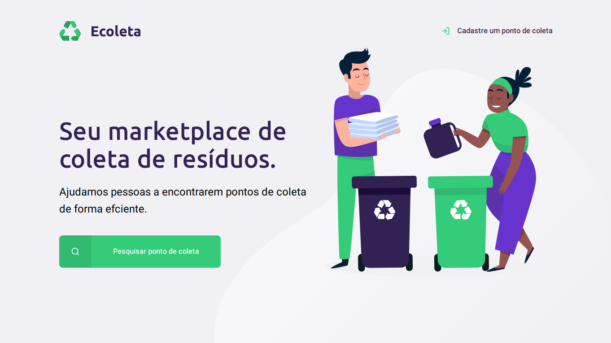
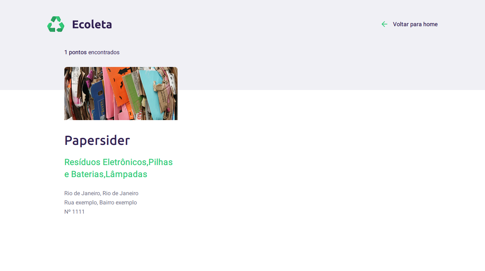
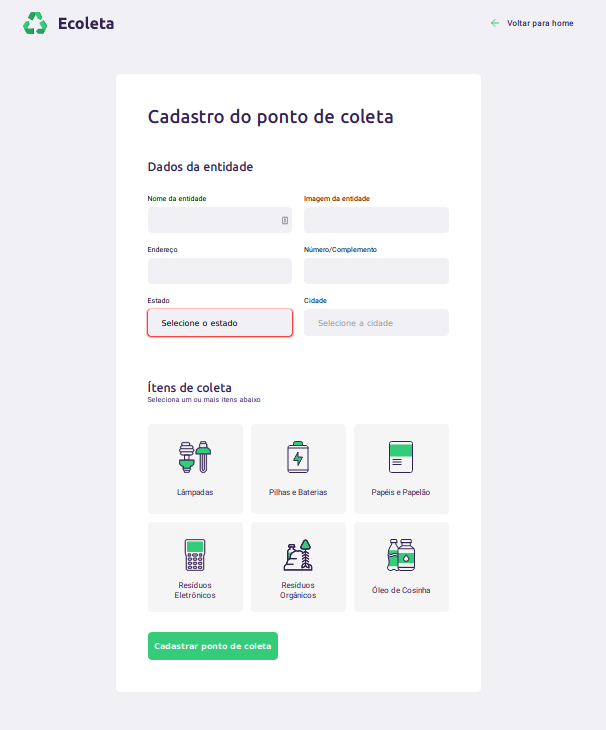

<div align="center">

# 


**Ecoleta é uma aplicação que ajuda a encontrar pontos de coleta de lixo reciclável no Brasil.**

Página principal



Página de pesquisa de Pontos de Coleta em uma determinada cidade



Página de cadastro de Ponto de Coleta



---


_Aplicação feita na Next Level Week #1 da [@Rocketseat](https://github.com/Rocketseat), nos dias 1 a 5 de Junho_


</div>

### Tecnologias


<br>


#### Front-end:

- [Nunjucks](https://mozilla.github.io/nunjucks/)
    - [HTML 5](http://www.w3.org/TR/html5/)
    - [CSS 3](https://www.w3schools.com/Css/)
    - [JavaScript](https://www.javascript.com/)

#### Back-end:

- [NodeJS](https://nodejs.org/)
    - [Express](https://expressjs.com/)
    - [Nodemon](https://nodemon.io/)
- [SQLite3](https://www.sqlite.org/)

### Uso

#### Instalar dependencias:
_com **npm**_
```bash
$ npm install
```
_com **yarn**_
```bash
$ yarn install
```

#### Iniciar servidor:

_com **npm**_
```bash
$ npm start
```
_com **yarn**_
```bash
$ yarn run start
```

> porta: 3000

Para trocar a porta basta ir em [src/server.js:97](https://github.com/mateusfg7/Ecoleta/blob/master/src/server.js#L97), e trocar o porta 3000 para a porta desejada.
```javascript
// turn on the server
server.listen(3000);
```

### Criar Bando de Dados

Para criar o banco de dados descomente as linhas 9 a 79, depois as linhas 11 a 26 do arquivo [src/database/db.js](https://github.com/mateusfg7/Ecoleta/blob/master/src/database/db.js)

```js
// use the object of the database, for our operations
db.serialize(() => {
    // create a table with SQL commands:
    // the firs param of data is the type of same
    // PRIMARY KEY -> main data
    // AUTOINCRMENT -> autoincrement when add a new register
    db.run(`
            CREATE TABLE IF NOT EXISTS places (
                id INTEGER PRIMARY KEY AUTOINCREMENT,
                image TEXT,
                name TEXT,
                address TEXT,
                address2 TEXT,
                state TEXT,
                city TEXT,
                items TEXT
            );
    `);

    // // insert data into the table with SQL commands
    // const query = `
    //     INSERT INTO places (
    //         image,
    //         name,
    //         address,
    //         address2,
    //         state,
    //         city,
    //         items
    //     ) VALUES (?,?,?,?,?,?,?);
    // `
    // const values = [
    //     "https://images.unsplash.com/photo-1567393528677-d6adae7d4a0a?ixlib=rb-1.2.1&ixid=eyJhcHBfaWQiOjEyMDd9&auto=format&fit=crop&w=1050&q=80",
    //     "Papersider",
    //     "Gulherme Gemballa, Jardim América",
    //     "Nº 260",
    //     "Santa Catarina",
    //     "Rio do Sul",
    //     "Papéis e Papelão"
    // ]

    // function afterInsertData(err) {
    //     if (err) {
    //         return console.log(err)
    //     }

    //     console.log("[personal] Cadastrado com sucesso")
    //     console.log(this)
    // }

    // db.run(query, values, afterInsertData);

    // // query table data with SQL commands
    // db.all(`SELECT * FROM  places`, function(err, rows) {
    //     if (err) {
    //         return console.log(err)
    //     }

    //     console.log("[personal] Aqui estão seus registros")
    //     console.log(rows)
    // })
    
    // // delete a table data with SQL commands
    // db.run(`DELETE FROM places WHERE id = ?`, [8], function(err) {
    //     if (err) {
    //         return console.log(err)
    //     }
        
    //     console.log("[personal] Registro deletado com sucesso")
    // })
});
```

e rode com
```bash
$ node src/database/db.js
```
O arquivo do banco de dados ficara salvo em src/database/database.db
Depois de criado, recomente as linhas e [rode o servidor]().


